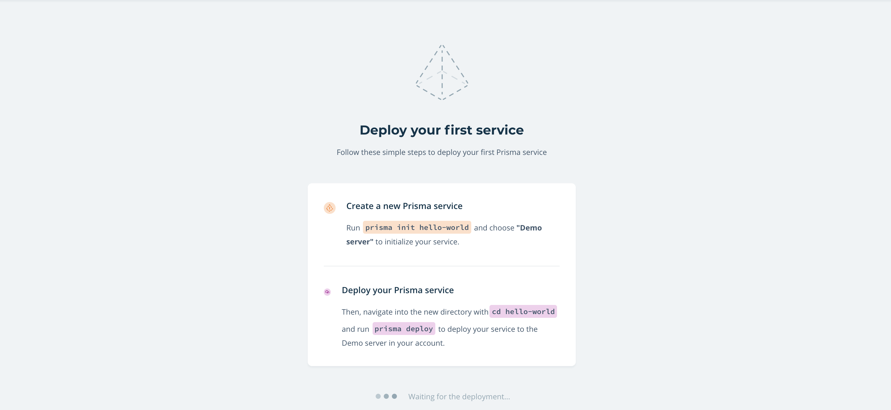
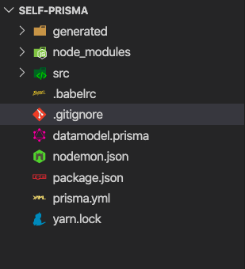
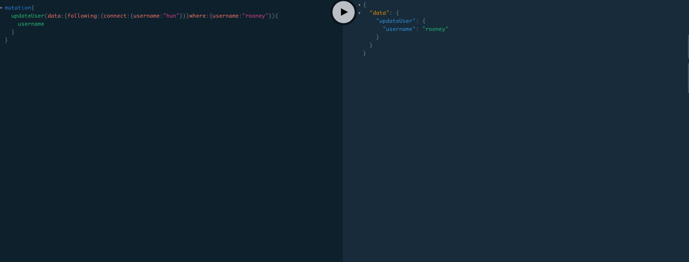

# prismagram_react-graphql

Instragram clone with Express Prisma React and React Native

## Backend

1. [Setting](#Setting)
1. [Create Server](#Create-Server)
1. [Prisma](#Prisma)

### Setting

```bash
# Backend Sever
yarn add graphql-yoga

# devDependency for ES6
yarn add @babel/node @babel/preset-env @babel/core

#devDependency that do not requrie server restart when you modity your code
yarn add nodemon -D

#Dependency that protect your secret info
yarn add dotenv

# middleware for logging
yarn add morgan
```

```bash
#.babelrc in root
{
    "presets": ["@babel/preset-env"]
}
```

```bash
#Create script code in package.json in root
 "script": {
      "dev": "nodemon --exec babel-node src/server.js"
  }
```

```bash
# nodemon.json in root (nodemon이 감시해야 할 파일의 확장자를 지정 할 수 있음)
{
    "ext": "js qraphql"
}
```

```bash
# .env in root
PORT = 4000
```

### Create Server

GraphQL 서버를 구성 할 때 `schema`와 `resolver`를 구성하고 이를 서버 생성자 함수의 인자로 추가해 주어야한다. 아래 코드처럼 server에 관한 코드를 작성한 파일에 `schema`와 `resolver`를 작성 할 수도 있고 `schema`와 `resolver`를 별도의 파일로 구성하여서 서버를 구성 할 수도 있다. 별도의 파일로 서버를 구성하는 경우 `schema`파일에 서버에서 사용 할 모든 `schema`를 작성하게되고, `resolver`도 마찬가지로 모든 `resolver`를 하나의 파일에 작성해야 한다. 이는 코드의 가독성을 떨어트리고 유지보수의 어려움을 야기시키므로 필요한 데이터에 따라 `schema`와 `resolver`를 구성하는 방법에 대해 알아본다. [GraphQL의 기본적인 사용방법][1]에대해 잘 모른다면 정리한 README가 있으니 참고하도록 한다.

[1]: https://github.com/CHEOLHUN/basic-theory-graphql_graphql

```javascript
//server.js
//기본적인 GraphQL 서버 구성 코드
import { GraphQLServer } from "graphql-yoga";
import logger from "morgan";

require("dotenv").config();
const PORT = process.env.PORT || 4000;

console.log(PORT);

const typeDefs = `
  type Query{
    hello: String!
  }
`;

const resolvers = {
  Query: {
    hello: () => "Hi",
  },
};

const server = new GraphQLServer({ typeDefs, resolvers });
server.express.use(logger("dev"));
server.start({ port: PORT }, () =>
  console.log(`Server running on port http://localhost:${PORT}`)
);
```

`graphql-tools`과 `merge-graphql-schemas`를 사용하는 경우 여러개의 `schema`와 `resolver`를 하나의 파일로 합쳐서 관리 할 수 있다.

```bash
#install modules
yarn add graphql-tools
yarn add merge-graphql-schemas
```

디렉토리의 구성은 아래와 같이 구성하면 된다.


`api`디렉토리안에 모든 `schema`와 `resolver`에 대한 파일을 넣게되면 api 디렉토리에 있는 `schema.js`파일에서 이 모든 파일을 합쳐서 하나의 `scheme`와 `resolver`로 만들어 준다. `schema.js` 코드는 아래와 같다.


```javascript
//schma.js
import { makeExecutableSchema } from "graphql-tools";
import { fileLoader, mergeResolvers, mergeTypes } from "merge-graphql-schemas";
import path from "path";

const allTypes = fileLoader(path.join(__dirname, "/api/**/*.graphql"));
const allResolvers = fileLoader(path.join(__dirname, "/api/**/*.js"));

const schema = makeExecutableSchema({
    typeDefs: mergeTypes(allTypes),
    resolvers: mergeResolvers(allResolvers)
});

export default schema;
```

```bash
#sayHello.graphql
type Query {
  sayHello: String
}
```

```js
//sayHello.js
export default {
  Query: {
    sayHello: () => "Hello"
  },
};
```

`fileLoader`가 api 디렉토리 안의 모든 파일을 가져오는 역할을 담당한다. `**`은 api디렉토리안의 `모든 디렉토리`를 의미하며, `*.graphql`은 `.graphql`확장자를 갖는 모든 파일을 의미한다. 즉 api 디렉토리 안의 `.graphql`확장자를 갖는 모든 파일을 가져와 `allTypes` 변수에 저장하는 것이다. `resolver`도 이와 같은 원리로 `allResolvers` 변수에 저장한다. 그 후 `mergeTypes`에 의해서 가져온 모든 `.graphql`파일을 하나의 타입으로 만들고, `mergeResolvers`에 의해서 모든 `resolver`파일을 하나의 resolver로 만든다 마지막으로 `makeExecutableSchema`로 `schema`와 `resolver`를 하나로 합쳐 주게된다.

```javascript
//server.js
require("dotenv").config();
import { GraphQLServer } from "graphql-yoga";
import logger from "morgan";
import schema from "./schema";

const PORT = process.env.PORT || 4000;

const server = new GraphQLServer({ schema });

server.express.use(logger("dev"));

server.start({ port: PORT }, () =>
    console.log(`Server running on port http://localhost:${PORT}`)
);
```

`server.js`에서 `schema.js`에서 만든 `schema`를 import 한 후 서버 생성자 함수의 인자로 넣어주면 각자 만든 Query를 사용 할 수 있게 된다. 앞으로 추가하게될 모든 Query나 Mutation등에 대해서도 별도의 설정없이 `api` 디렉토리안에 데이터별로 디렉토리를 생성하여 만들어주기만 하면 사용할 수 있다. `api`디렉토리에는 `schema`와 `resolver`에 관련된 파일 외의 다른 파일을 생성하면 에러가 발생하므로 주의하도록 한다.

### Prisma

#### Prisma init
프리즈마는 Object-Relational Mapping(객체 관계 연결, ORM)으로 어플리케이션에서 필요한 모델을 graphQL로 정의할 수 있다.

프리즈마를 사용하기 위해서는 우선 회원가입을 진행해야한다.  
[프리즈마 콘솔 사이트 바로가기]("https://app.prisma.io/)  
회원가입을 완료하면 아래와 같은 화면을 볼 수 있다. 초록색 `ADD A SERVICE`버튼을 눌러서 다음화면으로 넘어간다.  

화면에 나오는대로 yarn이든 npm이든 사용하는 노드모듈을 이용하여 prisma를 전역으로 설치해 준다. 설치가 완료되면 `Log into Prisma CLI`에 있는 프리즈마 로그인 코드를 복사하여 프로젝트 콘솔에서 실행시켜주도록 한다.  

로그인에 성공했다면 아래와 같은 화면을 볼 수 있다. `CREATE NEW SERVICE`버튼을 눌러 다음 화면이로 이동하도록 한다. 
  
아래 사진과 같이 프리즈마 서비스를 init 할 수 있는 코드를 볼 수 있다. 아래 코드대로 진행해도 되지만 진행하는 프로젝트의 콘솔에서 `prisma init`이라고 입력하여서 진행 할 수 있다. 
  
`prisma init`이라고 입력하면 아래와 같이 개발환경을 선택 할 수 있는 옵션을 볼 수 있다. 3번째 옵션인 Demo server + MySQL database를 선택하여 실습을 진행하였다.
    

`prisma init`을 완료하면 아래 사진와 같이 폴더와 파일이 생성되는 것 을 확인 할 수 있다. 생성되는 파일과 폴더는 다음과 같다.
- generated(폴더)
- prisma.yml
- datamodel.prisma

    
generated(폴더)와 prisma.yml는 공개되지 않아야 할 정보들이 담겨있으므로 .gitignore을 통해 저장소에 저장되지 않도록 한다.

#### Prisma deploy
`datamodel.prisma` 파일이 바로 어플리케이션에 필요한 데이터 모델을  graphQL을 통해 생성 할 수 있도록 해주는 파일이다. 해당 파일에 graphQL을 통해 모델에 대한 코드를 작성하고 `prisma deploy` 명령어를 입력하면 모델이 생성된다.

```bash
#datamodel.prisma
type User {
  id: ID! @id
  name: String!
}
```
위와 같이 코드를 입력하고 `prisma deploy`명령어를 실행시키면 아래 사진과 같이 prisma console에 User라는 이름의 데이터 모델(query)이 생성된 것을 확인 할 수 있다.
  

#### DataModel with Prisma
```bash
#datamodel.prisma
type User {
  id: ID! @id
  username: String! @unique
  email: String! @unique
  firstName: String @default(value: "")
  lastName: String! @default(value: "")
  bio: String
  followers: [User!]! @relation(name: "FollowRelation")
  following: [User!]! @relation(name: "FollowRelation")
  posts: [Post!]!
  likes: [Like!]!
  comments: [Comment!]!
  rooms: [Room!]!
  loginSecret:String
}

type Post {
  id: ID! @id
  location: String
  caption: String!
  user: User!
  files: [File!]!
  likes: [Like!]!
  comments: [Comment!]!
}

type Like {
  id: ID! @id
  user: User!
  post: Post!
}

type Comment {
  id: ID! @id
  text: String!
  user: User!
  post: Post!
}

type File {
  id: ID! @id
  url: String!
  post: Post!
}

type Room {
  id: ID! @id
  participants: [User!]!
  messages: [Message!]!
}

type Message {
  id: ID! @id
  text: String!
  from: User! @relation(name: "From")
  to: User! @relation(name: "To")
  room: Room!
}
```
위 코드와 같이 graphQL과 prisma 문법을 사용하여 데이터 모델을 정의한다. 몇가지 살펴와야하는 부분이 있는데 보다 자세한 내용은 공식문서를 참조하도록 한다.  
[공식문서 바로가기](https://v1.prisma.io/docs/1.34/datamodel-and-migrations/datamodel-MYSQL-knul/#sdl-directives)  
  
##### id: ID! @id
모든 데이더 모델에 공통적으로 들어가있는것이 있는데 바로 id이다. 경우에따라 id를 생략 할 수도 있지만 생략하게 되면 resolver를 prisma가 자동으로 생성해 주지 않는다. 프리즈마의 편한점은 resolver를 데이터 모델을 기반으로 자동으로 생성해 주는 것이다. 기존의 mongoDB나 mysql만 사용하는 경우 데이터베이스 안의 데이터를 생성하고 삭제하고 수정하는 등의 행위를 하기 위해서 별도의 코드를 작성해야했다. 그러나 prisma를 이용하면 별도의 코드 작성은 불필요하다. 

##### @unique/@default/@relation
- @unique의 경우 데이터베이스안에 중복된 값으 존재할 수 없다는 의미이다. @unique 키워드를 부여한 값을 통해서 특정 데이터를 찾을 수 있다.

- @default의 경우 초기값을 지정해주는데 사용한다. 

- @relation의 경우 데이터간의 양방향 관계를 설정하는데 사용한다.

##### createUser
위 코드를 delopy하고 prisma.yml 파일에 적혀있는 endpoint 주소를 브라우져에 입력하여 ployground를 실행하도록 한다. (참고로 endpoint는 타인에게 알려줘서는 안된다. 해당 ploygound에서 데이터의 변경이 가능하기 때문이다.)  


엔드포인트에 들어가게 되면 우리가 설정한 데이터를 기반으로한 query와 mutation이 자동으로 생성되있는것을 확인 할 수 있다. 이를 통해 유저를 생성할 수도 있고 유저 정보르 변경할 수도 있으며 유저를 삭제 할 수도 있다. (post, comment등 모든 데이터에 대해 가능하다.)

위 사진과 같이 mutation을 실행시키면 유저가 생성된것을 확인 할 수 있다. 아래 사진과 같이 prisma console에서도 확인 가능하다.(간혹 모든 입력을 정확히 했는데 에러가 발생하는 경우 크롬을 사용한다면 localStorage를 삭제한다음 로그아웃하고 다시 로그인하면 에러가 사라지는 경우가 있다. prisma console 버그인듯하다.)


#### findUser

위 사진에서 보듯 우리가 데이터 모델을 설정 할 때 @unique키워드를 부여한 데이터를 가지고 특정 User를 찾을 수 있는 것을 확인 할 수 있다. 

#### relation data
앞서 데이터를 정의할 때 몇몇 데이터에 @relation 키워드를 부여하였다. 그 중 followers와 following 의  양방향 관계에 대해 살펴본다. 

- rooney와 hun 이라는 username을 갖는 두 사용자가 있다.
- rooney가 hun을 following 한다.
- hun의 followers에 rooney가 자동으로 추가될 것이다.

위의 시나리도대로 진행된다면 정상적으로 양방향 관계가 설정된것이다. 아래 사진 처럼 user정보를 update한다.

정상적으로 hun을 following 한것을 확인 할 수 있다.
이제 hun의 데이터를 살펴보도록 한다.

hun 데이터의 followers에 rooney가 추가 된것을 확인 할 수 있다.